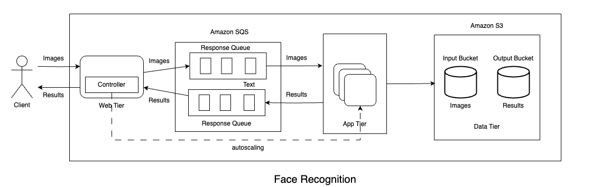

# Multi-Tier Face Recognition Application

This project is a cloud-based, multi-tier face recognition application that processes images of people, identifies faces, and returns their names with minimal latency. The system is designed for scalability and performance, with components distributed across different cloud infrastructure services.

Given an image, the application uses a pre-trained machine learning model (`facenet_pytorch`) to recognize the person in the image. The architecture is composed of three main layers: the Web Tier, App Tier, and a Custom Load Balancer, each with distinct functionalities to ensure smooth and efficient processing.

## Architecture Design



*Figure: System Architecture of the Multi-Tier Face Recognition Application*

### Architecture Overview

The application is divided into three primary components, each hosted in a separate repository:

1. **Web Tier**: Handles HTTP requests, forwards images to the App Tier, and returns results to clients.
2. **App Tier**: Processes images using face recognition and returns the name of the person in the image.
3. **Custom Load Balancer**: Manages scaling of App Tier instances on AWS based on request volume.

### Key Components and Flow

- **Client**: The client sends an image to the Web Tier, which acts as the entry point for processing.
- **Web Tier**: Receives images, forwards them to the App Tier, and returns the recognized results to the client. It also connects to an InfluxDB instance for dummy data population.
- **Amazon SQS**: Used to manage queues between the Web Tier and App Tier, facilitating scalable message passing.
- **App Tier**: Uses a pre-trained face recognition model (`facenet_pytorch`) to process images and return results.
- **Amazon S3**: Stores input images and output results as needed for additional data persistence.
- **Custom Load Balancer**: Monitors incoming request load and dynamically scales App Tier instances on AWS to maintain performance.

### Key Features

- **Distributed Processing**: Each tier operates independently, allowing scalable processing and easy maintenance.
- **Custom Load Balancing**: Manages the App Tier instances dynamically, without relying on AWS's auto-scaling services.
- **Dockerized Deployment**: Each component is containerized, simplifying deployment and ensuring environment consistency.
- **Zero-Downtime CI/CD Pipeline**: Ensures seamless deployment without affecting the application's availability.

# Web Tier

## Description
The Web Tier is responsible for handling incoming HTTP POST requests with images, sending these images to the App Tier for processing, and returning the recognition results to the client. It also includes an endpoint for populating dummy data into an InfluxDB instance for testing and monitoring purposes.

## Features
- **Image Handling**: Accepts image files from clients and forwards them to the App Tier.
- **Data Population Endpoint**: Provides an endpoint to populate dummy data into an InfluxDB instance.
- **Minimal Latency**: Designed to process requests quickly and return results with minimal delay.

## Tech Stack
- **Programming Language**: Go
- **Dependencies**: InfluxDB for dummy data population, Docker for containerization

## Deployment Steps

### 1. Configure GitHub Secrets and Variables
   - Set up the required secrets and variables in your GitHub repository settings.
   - Add `GHCR_TOKEN`, `SSH_PRIVATE_KEY`, `INFLUXDB_TOKEN`, `AWS_ACCESS_KEY_ID`, and `AWS_SECRET_ACCESS_KEY` as secrets.
   - Add `SERVER_USERNAME`, `SERVER_IP_ADDR`, `INFLUXDB_URL`, `INFLUXDB_BUCKET_NAME`, `INFLUXDB_ORG_NAME`, `AWS_DEFAULT_REGION`, `AWS_IN_BUCKET_NAME`, `AWS_OUT_BUCKET_NAME`, `AWS_REQ_URL`, and `AWS_RESP_URL` as repository variables.

### 2. GitHub Actions Workflow
   - The workflow is triggered on a push to the `main` branch or via a manual dispatch. It builds the Docker image for the Web Tier and pushes it to GitHub Container Registry (GHCR).
   - The `deploy` job then connects to the server via SSH, deploys the new Docker image to the server, and updates the Nginx configuration for zero-downtime deployment using a blue-green deployment strategy.

### 3. Blue-Green Deployment Process
   - The workflow identifies the current active and inactive containers (`api-server-blue` and `api-server-green`).
   - It deploys the new Docker image to the inactive container, performs a health check, and switches traffic to the new container if the check passes.
   - Nginx configuration is updated to route traffic between `api-server-blue` and `api-server-green` containers, ensuring zero-downtime during the deployment.

### 4. Rollback Mechanism
   - If the health check fails after deploying the new image, the workflow reverts Nginx to point only to the previous container, and the failed container is stopped and removed.
   - This rollback ensures uninterrupted service if an issue is detected with the new deployment.

### 5. Docker and Nginx Setup
   - Docker is used to build, deploy, and manage containers on the server.
   - Nginx is configured with a load-balancing setup to switch between `api-server-blue` and `api-server-green` containers, providing high availability and zero-downtime deployment.

### 6. Running the Deployment
   - The workflow can be manually triggered via the GitHub Actions tab by specifying the branch, tag prefix, and commit reference.
   - On success, the updated application will be available on the specified server endpoint.

This deployment setup leverages GitHub Actions and Docker for CI/CD, automating the Web Tier deployment with a focus on high availability and minimal service disruption.

## Local Deployment Steps

### Prerequisites
- **Docker**
- **Go**

### Steps

1. **Export AWS Environment Variables**
   - Set up the necessary AWS environment variables required for the application:
     ```bash
     export AWS_ACCESS_KEY_ID=your_aws_access_key
     export AWS_SECRET_ACCESS_KEY=your_aws_secret_access_key
     export AWS_DEFAULT_REGION=your_aws_region
     export AWS_IN_BUCKET_NAME=your_input_bucket_name
     export AWS_OUT_BUCKET_NAME=your_output_bucket_name
     export AWS_REQ_URL=your_request_url
     export AWS_RESP_URL=your_response_url
     ```

2. **Install InfluxDB**
   - Run the following command to install and start InfluxDB in a Docker container:
     ```bash
     docker run \
       --name influxdb2 \
       --publish 8086:8086 \
       --mount type=volume,source=influxdb2-data,target=/var/lib/influxdb2 \
       --mount type=volume,source=influxdb2-config,target=/etc/influxdb2 \
       --env DOCKER_INFLUXDB_INIT_MODE=setup \
       --env DOCKER_INFLUXDB_INIT_USERNAME=ADMIN_USERNAME \
       --env DOCKER_INFLUXDB_INIT_PASSWORD=ADMIN_PASSWORD \
       --env DOCKER_INFLUXDB_INIT_ORG=ORG_NAME \
       --env DOCKER_INFLUXDB_INIT_BUCKET=BUCKET_NAME \
       influxdb:2
     ```

3. **Export InfluxDB Environment Variables**
   - Set up the InfluxDB environment variables required for connecting to the database:
     ```bash
     export INFLUXDB_TOKEN=your_influxdb_token
     export INFLUXDB_URL=http://localhost:8086
     export INFLUXDB_BUCKET_NAME=your_bucket_name
     export INFLUXDB_ORG_NAME=your_org_name
     ```

4. **Run the Web Server**
   - Start the Web Tier server locally by running the following command:
     ```bash
     go run main.go
     ```

5. **Check Server Health**
   - Verify that the server is running by navigating to [http://localhost:1323/health](http://localhost:1323/health). You should see the message: `Up and running!`

### Note
This Web Tier service is designed to work with the [Load Balancer](https://github.com/dhruv-assessment/load-balancer) for the face recognition endpoint. Please ensure the load balancer is running concurrently to utilize the face recognition functionality effectively.
